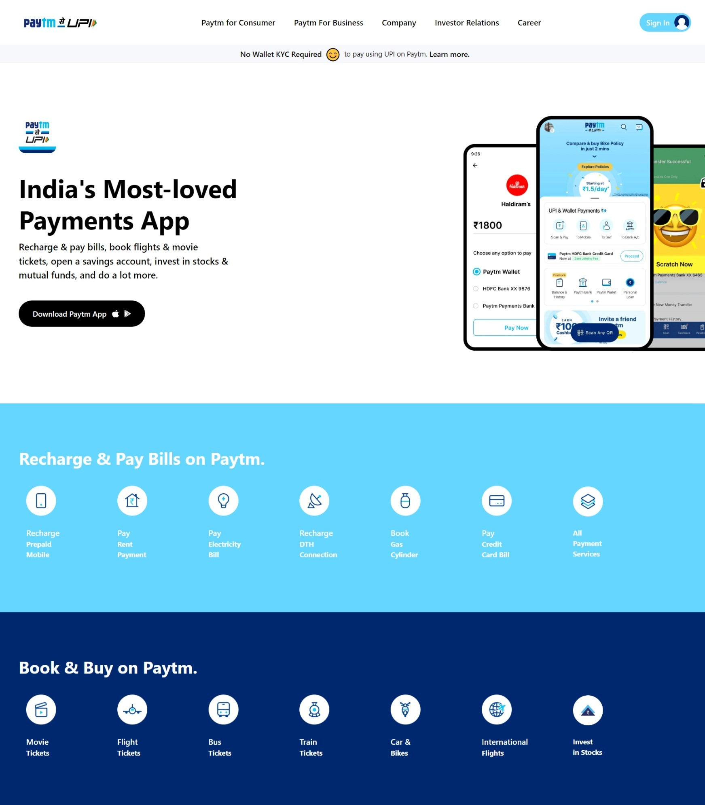

# **Saiprasad Ingle**

## **Project - 16**

## **Project Title** - Paytm Clone 
This clone home page made by using Html & tailwindCss.

##  Time to complete this project :-

## What I have Learned in this Project :-

- How to use - **tailwind classes**.
- Layout Making Using - **Flexbox**.
- How to make - **Cards**
- How to insert - **Icons**
- How to Make - **Beautiful Buttons**.

## Technology Used :-

Project  built from using

 
**&**

[Click Me](https://resilient-gnome-7f82d5.netlify.app/) to see the project Demo.

## Screenshot of  project :-

## Features :-

- Live previews
- Fullscreen mode
- Mobile responsive
- Tablet responsive

## 🔗 Links
